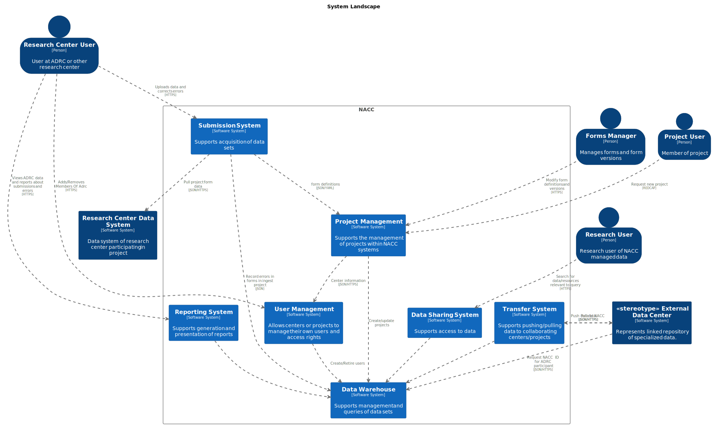
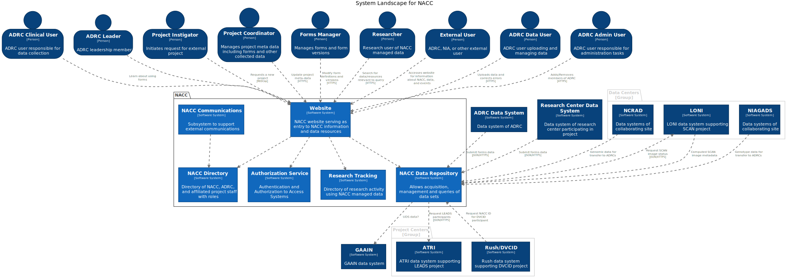

# NACC System Landscape

This document describes a model of the software systems supporting the National Alzheimer's Coordinating Center (NACC).

## Document Purpose

The goal of this document is to help the reader understand what NACC is and the environment in which NACC operates.
However, the software system is model is modeled in a desired state of software systems, rather than describing the existing system  that has grown organically within NACC.

## About NACC

NACC is the coordinating center for the Alzheimer's Disease Research Center (ADRC) program of the NIH, which funds ADRCs across the country.
Clinical representatives from the ADRCs (the Clinical Task Force) define the protocol used to gather data, mainly through a set of forms called UDS (or Uniform Data Set).
However, centers collect other common forms of data from the ADRCs, such as imaging and neuropathology exam data.
As the coordinating center, NACC serves primarily as the warehouse of data collected at ADRCs, and is a conduit for returning to the ADRCs data derived elsewhere and stored at other data centers, including NCRAD, NIAGADS, and LONI.

However, NACC also manages data for affiliated projects.
These are often specialized studies that collect UDS form responses for non-ADRC participants, or use the data from subsets of the UDS participants.
These projects are defined and managed separately from the UDS project, and may involve non-ADRC sites.
But they generally use some of the UDS forms along with collecting other data.

NACC also contributes warehoused UDS data to other projects (e.g., GAAIN).

## NACC data

ADRD data are of multiple kinds:

- Form responses – these are data collected from the completion of forms. 
  Responses may be captured electronically using a system such as REDCap, or may be captured on paper and transcribed into a data file manually.
  NACC forms data is primarily responses for the Uniform Data Set and associated modules.
- MR or PET Images – these are collected by imaging cores at research centers.
  These are a series of images created during a single session, and have associated metadata in a DICOM header.
- Other data – these could be images collected by visualization of neuropathology slides, audio/video files capturing interaction with the participant, movement sensor data, and EHR data.

All data at NACC is associated with a participant who is given a NACC specific ID.
This individual is also identified by a center ID and center-assigned participant ID.

Data stored at other sites is searchable at NACC.

Data is frozen quarterly to provide a fixed set of data for research.

## NACC functions

To support NACC’s role, there are five key functions of NACC data systems: 

1. *Receiving data*: Data can be received from centers in three ways, through an online form interface, a batch submission interface, and through API endpoints.
   Data quality is ensured before the data is stored.
2. *Providing data*: Users may browse or search for data. 
   Data may also be accessed via API. 
   ADRC users will see center participant IDs for data corresponding to visits at the ADRC, while everyone else will see NACC IDs.
   ADRC users will also have access to data generated at other sites including ADGC genotyping/imputation data from NIAGADS. 
3. *Storing data*: All three types of data can be stored.
   And, all data is sufficiently indexed to support efficient searches.
   All data has provenance indicating where it came from and whether it has been transformed.
   Externally accessible data is also indexed.
4. *Transferring data*: NACC may push data to or pull data from other centers. 
   Examples of pulled data is SCAN analytical data derived from images stored at LONI.
   Pushed data is something like the list of NACC IDs for a data freeze pushed to NCRAD.
5. *Reporting on NACC data*: Reports may be generated that reflect the data available, status of data, and audits of data quality.

## Landscape model

Interfaces with external users and systems are shown in the following diagram.

As this model shows, the system provides interfaces for external users of the system, which include the following

1. Research center users - Research centers provide data to NACC. 
   Specifically, the NIA Alzheimer's Disease Research Centers (ADRCs) provide UDS data to NACC. 
   ADRCs have more consistent structure than non-ADRCs involved in non-UDS projects, and these are the ADRC user roles that we describe in this model:
    1. ADRC Administrative user – an administrative user manages the ADRC relationship with NACC, determining which staff are users of NACC systems and in what role.
    2. ADRC Clinical user - a clinical user interacts with participants and is responsible for capture of data ultimately stored at NACC.
    3. ADRC Data user – a data user 
    4. ADRC Leadership user – a director of the center or core of the center.
2. Project Users – Project users are responsible for the metadata that defines a project and how it is managed within NACC.
    1. Project Administrative user – manages the project relationship with NACC, determines what data the project collects, and which centers can contribute data.
    2. Project Instigator - initiates the creation of a project within NACC by making an intake request. Provides initial definition of the project.
3. Forms manager - a user that is responsible for the definition and maintenance of a set of forms including questions and data validations.
   This person may be internal to NACC.
4. Researcher - a user who is using NACC managed data for research.
5. Other external users include members of the public, staff from NIA, ADRCs, NACC, or legislatures who are interested in information, events or resources provided by NACC.

There are also several external systems that integrate with NACC systems that include the following:

1. ADRC Data System – some ADRC manage their own data management systems that they would like to have interact directly with NACC APIs. 
   These systems typically involve some form of Electronic Data Capture that populates a database. 
   NACC APIs may be used for validating or submitting data, or pulling center specific data.
   Data submitted by an ADRC may include form responses, EHR records, images (MRI/PET), and files from digital or other phenotyping capture.
2. Data centers
   1. NCRAD – NCRAD provides data to be distributed to ADRCs based on the processing of samples submitted.
   Additionally, NACC centralized search capabilities would link to NCRAD records for UDS participants.
   2. NIAGADS – NIAGADS provides genotype data from the ADGC to be distributed to ADRCs based on genotyping of samples submitted to NCRAD.
   Additionally, NACC centralized search capabilities would link to NIAGADS records for UDS participants.
   3. LONI – LONI supports the SCAN project by collecting MRI/PET images, which are then analyzed by SCAN computational teams.
   LONI provides NACC with status data for uploads and results of SCAN computational results.
   Additionally, NACC centralized search capabilities would link to LONI records for SCAN images.
3. Project centers
   1. ATRI – ATRI supports the LEADS project, and NACC pulls a participant list from ATRI to create a report for LEADS for UDS submissions.
   3. Rush – Rush university supports the DVCID project
4. GAAIN - [GAAIN](http://www.gaain.org/) is a meta-database of Alzheimer's Disease data to which UDS data is contributed.

## Complete external interactions

This model shows the full complexity of the system interface

