# Domain model 

This document describes the domain model for the software systems supporting the National Alzheimer's Coordinating Center (NACC).

## Document Purpose

The goal of this document is to help the reader understand the objects that occur.

## Domain Objects

The repository captures data for for a project, the goal of which is to capture (longitudinal) standardized observations for the enrolled participants.
A project consists of centers that enroll and observe participants, and a design that determines the observations made.

## Enrollment

A participant is enrolled in a project at a particular center for a particular time period.

Enrollment is not exclusive.
A participant may end up enrolled at multiple centers for the same project, because participants move without telling centers, or go to other centers for second opinions.
Or, may be enrolled in more than one project at the same center.

Cases where the participant moves without telling anyone can result in the participant being assigned a new ID.
But genetic tests will often catch these aliases from the simultaneous enrollments.

## Observations

Observations are captured at the center where the participant is enrolled.

As determined by the project design, observations may be form responses, images, other forms of digital data, or biospecimens captured during the visit.

## Design

> Leaving out the details of project design for now
