# Domain model 

The repository captures data for for a study the goal of which is to capture (longitudinal) standardized observations for the enrolled participants.
A study consists of centers that enroll and observe participants, and a design which determines the observations that will be made.

Observations are captured at a study center where the participant is enrolled within the study.

*note: need to represent participant enrollment at a center being time dependent*

As determined by the study design, observations may be form responses, images, other forms of digital data, or biospecimens captured during the visit.

All but biospecimens can be storied as files or other structured data.
In the context of NACC, a biospecimen may be represented as a reference to a sample at a tissue repository (e.g., NCRAD).

The data set for a study includes any files capturing observations, and *variables*, each of which is a value extracted or derived from an observation.

Examples include

1.  encoded form response for a question, 
2.  a biomarker derived from a biospecimen,
3.  a volumetric measure computed from an image series, or
4.  a measure of cognition computed from tablet-based assessments.

Observations must meet the study design

