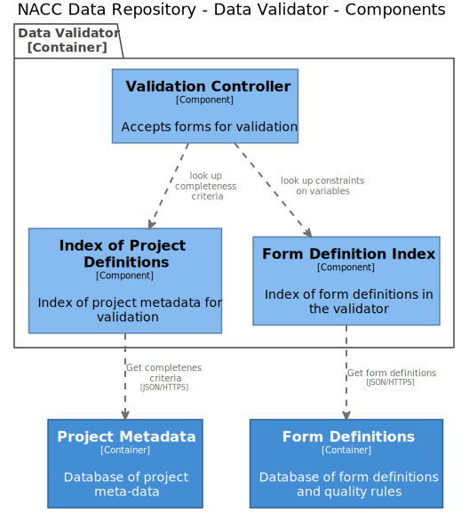

# NACC Data Repository

## Context 

this is the description of the NACC system context


## Architecture


## Submission

BLAH

## Data Validation



## Form Definitions


```yaml
---
version: "0.0.1"
form_set:
  name: UDS
  version: "4.0.0"
  languages:
    - English
    - Spanish
  forms:
    - A1
    - A2
    - A3
    - A4
    - A5
    - B1
    - B1A
    - B4
    - B5
    - B6
    - B7
    - B8
    - B9
    - C2
    - D1
    - D2
```

```yaml
---
version: "0.0.1"
study: UDS
design:
  uds:
    form_set: 
      name: UDS
      version: "4.0.0"
    languages:
      - English
      - Spanish
    required:
      - A1
      - A5
      - B4
      - B8
      - B9
      - C2
      - D1
      - D2
  ftld:
    form_set:
      name: FTLD
      version: "4.0.0"
    languages:
      - English
      - Spanish
    required:
      - B3F
      - B9F
      - C1F
      - C2F
      - C3F
      - E2F
      - E3F
  cls:
    form_set:
      name: CLS
      version: "4.0.0"
      languages:
        - English
        - Spanish
      only_once:
        - CLS
```

```yaml
---
version: "0.0.1"
form: A1
language: English
description: Subject Demographics
questions:
  - question:
    number: 1
    text: Primary reason for coming to ADC
    responses:
      - response:
          text: To participate in a research study
          encoding: 1
      - response:
          text: To have a clinical evaluation
          encoding: 2
      - response:
          text: Both (to participate in a research study and have a clinical evaluation)
          encoding: 4
      - response:
          text: Unknown
          encoding: 9

    

```

```yaml
---
version: "0.0.1"
form: A2
language: English
description: Co-participant Demographics
questions:
  - question:
    number: 1
    text: What is co-participant's relationship to the subject?
    responses:
      - response:
          text: Spouse, partner, or companion (include ex-spouse, ex-partner, fiance(e), boyfriend, girlfriend)
          encoding: 1
      - response:
          text: Child (by blood or through marriage or adoption)
          encoding: 2
      - response:
          text: Sibling (by blood or through marriage or adoption)
          encoding: 3
      - response:
          text: Other relative (by blood or through marriage or adoption)
          encoding: 4
      - response:
          text: Friend, neighbor, or someone known through family friends, work, or community (e.g., church)
      - response:
          text: Paid caregiver, health care provider, or clinician
          encoding: 6
```

```yaml
version: "0.0.1"
variables:
  - variable:
      name: INRELTO
      question:
            form: A2
            number: 1
  - variable:
      name: INKNOWN
      question:
          form: A2
          number: 2
  - variable:
      name: INLIVWTH
      question:
          form: A2
          number: 3
  - variable:
      name: INCNTMOD
      question:
            form: A2
            number: 4
  - variable:
      name: INCNTMDX
      question:
          form: A2
          number: 4a
      constraints:
          - blank_unless ...
```
