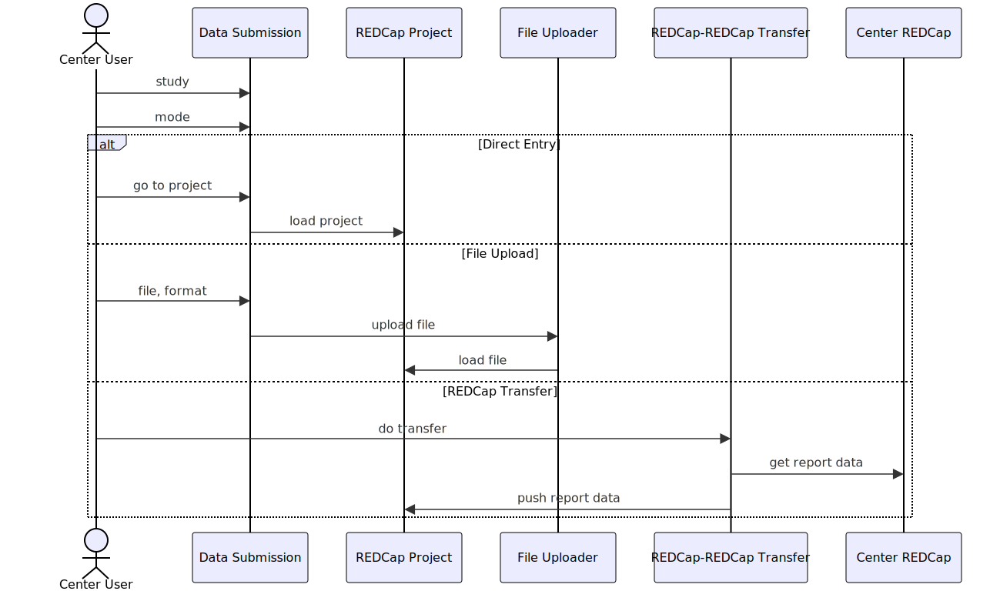
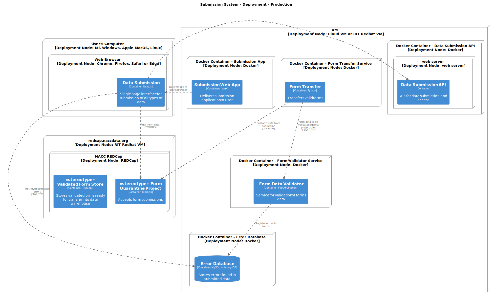

# Submission system

The submission system of the National Alzheimer's Coordinating Center (NACC) is meant to accept data managed by NACC on behalf of the ADRC program and other affiliated studies.
The ADRC program has traditionally accepted data collected by the ADRCs using the Uniform Data Set forms, but now also accepts PET and MRI imaging files, and in the future will accept other data types.

## Document Purpose

This document describes the model of the software systems supporting data submission to NACC.

## Context

The submission system is a component of the ADRC portal that allows users at research centers to submit data captured at the center.

At it's core, the submission system takes data provided by a research center and moves it into an ingest pipeline within the data warehouse.
This system will check that submitted data meets expectations for the study, which are managed using the [project management system](03-project-management.md).

## Functional Overview

## Quality Attributes

## Constraints

## Principles

## Architecture

The submission system consists of a submission interface, and for each data type data submission services, and any services needed to transfer data into the data type specific ingest pipeline in the data warehouse.

### Form Submission

Forms are handled by routing the data into a REDCap project from which data is then transferred into the form ingest project for the center within the data warehouse.
Data may be submitted in three ways:

1. Direct data entry in the project hosted on the NACC REDCap.
   For this, the submission interface should route the user to the data entry page for the quarantine project in REDCap.
2. File upload.
   The submission interface initiates a file upload for data in CSV format.
   This file may be a REDCap export of the "NACC Export" project from the center's REDCap, or a CSV file from a different source (format TBD).
3. Transfer from a project on a center's REDCap instance to the NACC REDCap instance.

The following sequence diagram sketches the user interactions with the submission interface.

## Code

<!-- ## Deployment

 -->