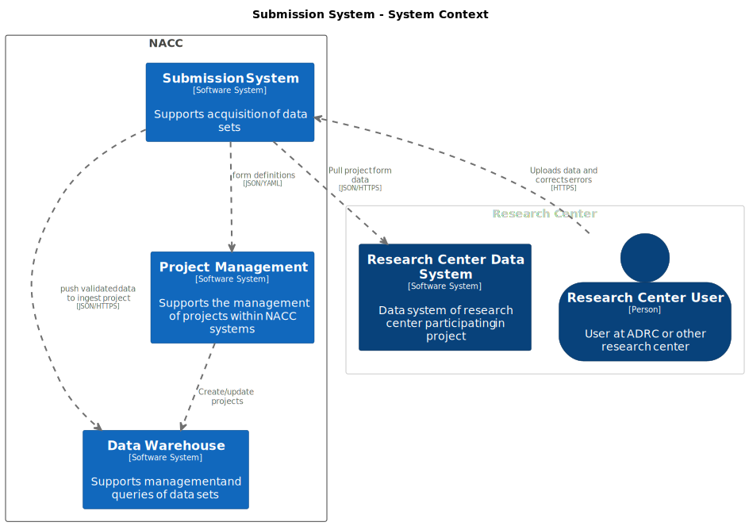

# Submission system

This document describes the model of the software systems supporting data submission to the National Alzheimer's Coordinating Center (NACC).

## Document Purpose

## Context

## Architecture

<!-- ## Deployment

 -->